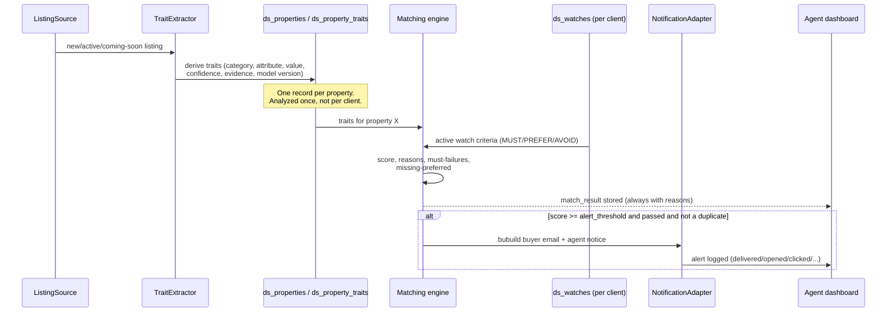
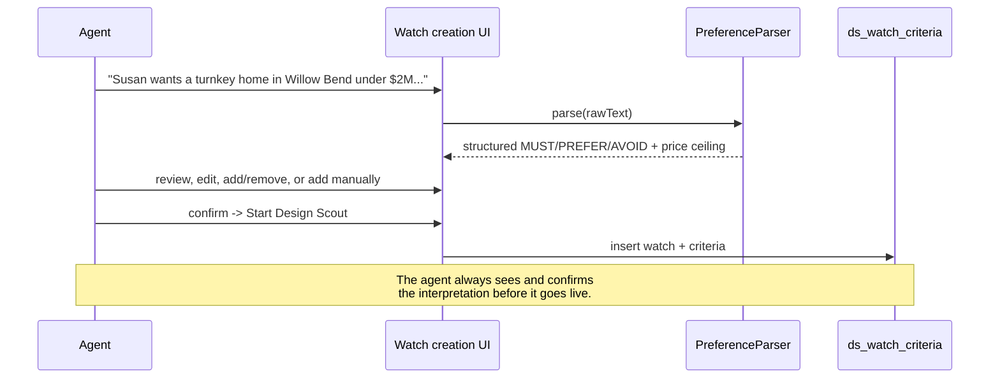

# Design Scout — Architecture

Status: v1 vertical slice. Dated 2026-09-19. Internally referred to as
"Home Watch" during initial product planning; "Design Scout" is the
customer-facing name and is used consistently in code, routes, and copy.

## Product goal

MLS structured fields tell an agent which properties exist. Search by
Design determines what those properties are actually *like* — niche,
non-searchable design and character traits pulled from listing photos,
remarks, and history — and continuously watches new inventory for a
specific client's preferences, so an agent doesn't have to re-search
manually every day.

## Relationship to Drake's Pricing

Both products sit on the same **Property Intelligence Layer**:

```
Property Intelligence Layer (traits, once per property)
        |
        +--> Design Scout: "Who wants this property?"
        |
        +--> Drake's Pricing: "What is this property worth, and how
             should it be priced?"
```

They share authentication, workspace identity, and (eventually) the same
property record — Pricing can pull verified/inferred condition, quality,
renovation, and architectural traits into comp selection and valuation
adjustments once that hand-off is built. That hand-off is **not** built
yet; today it's a single link from a Design Scout match to the
existing Pricing Desk workstation (see `ds_watches` detail page).

Nothing in this feature modifies Pricing's existing tables, pages, or
behavior. See `STATUS_REPORT.md` for the full list of files touched.

## Data flow: new listing to alert



## Natural-language setup flow



## Taxonomy: Category → Attribute → (Value, Confidence, Evidence)

`lib/design-scout/taxonomy.ts` is the source of truth for ~20
categories (Architectural Style, Historic/Character, Exterior, Kitchen,
Appliances, Wine/Beverage/Bar, Entertainment, Bathroom, Interior Design,
Condition/Renovation, Windows, Flooring, Ceilings, Fireplaces, Specialty
Rooms, Primary Suite, Functional Layout, Lot/Privacy, Outdoor Living,
Pool/Spa, Garage) and ~230 attributes, transcribed from the product spec.

The schema is deliberately flat at the reference-data level
(`ds_taxonomy_categories` → `ds_taxonomy_attributes`) so adding
attribute #231 or category #21 never requires a migration — only a row.
Confidence, evidence, source type, model version, and timestamps live on
`ds_property_traits` (the instance data), never on the taxonomy itself.

Two rules enforced by the taxonomy's shape, not just convention:

- **Historic designation vs. historic character are different attributes**
  (`confirmed_historic_designation` vs. `historic_character`). A property
  is never allowed to conflate "we inferred old charm from photos" with
  "this has an actual historic designation."
- **Brand and named-architect claims carry `highEvidenceBar: true`**
  (Sub-Zero, Wolf, Frank Lloyd Wright/Prairie, etc.). The trait extractor
  only marks these `confirmed` when corroborated by both remarks and photo
  evidence; otherwise the value is `likely`. Copy never says a property
  "was designed by Frank Lloyd Wright" — only "Wright-inspired" /
  "Prairie influence."

## Services and adapters

| Concern | Interface | v1 implementation | Real implementation needs |
|---|---|---|---|
| Preference parsing | `PreferenceParser` (`parser.ts`) | `KeywordPreferenceParser` — rule-based MUST/PREFER/AVOID + price extraction | An AI/vendor decision (`createLLMPreferenceParser` throws until configured) |
| Listing ingestion | `ListingSource` (`listing-adapter.ts`) | `SyntheticListingSource` — fixed test listings | MLS/data-provider access + confirmed licensing |
| Trait extraction | `TraitExtractor` (`listing-adapter.ts`) | `KeywordTraitExtractor` — text-only (remarks + photo captions) | A vision model for actual photo pixel analysis |
| Matching/scoring | `scoreProperty`/`shouldAlert` (`matching.ts`) | Real logic, not a stub | Tuning of weights/thresholds against real data |
| Notifications | `NotificationAdapter` (`notify.ts`) | `ConsoleNotificationAdapter` — logs, doesn't send | An email provider (SES/Postmark/Resend/etc.) |

Every adapter is swappable behind its interface so no component is
permanently locked to one vendor, per the spec's requirement.

## Why one Property Intelligence Record, not one per client

`ds_properties` / `ds_property_traits` are keyed by property (workspace-
scoped), not by (property, client). `runDemoMatchingAction` extracts traits
once per property and reuses the stored record for every watch it's
compared against — the pipeline never re-analyzes the same listing twice
for two different clients.

## Subscriptions and gating

`product_subscriptions` (workspace_id, product, status) is shared
infrastructure both product lines read. A trigger auto-grants every
workspace `pricing_desk` access on creation (preserving current behavior —
Pricing was the only product before this migration). `design_scout`
is opt-in; there's no billing integration yet, so the dashboard offers a
manual "Enable Design Scout (beta)" action. `subscription_plans` is a
config-driven table (not hard-coded UI) seeded with the proposed beta
tiers so prices/limits can change without a code deploy.

## Known limitations of this vertical slice

- The NL parser is rule-based, not LLM-backed; it's good enough for the
  demo scenario (tested against the spec's Susan/Willow Bend example) but
  will misclassify phrasing it doesn't recognize. The agent-review step
  before confirming a watch is the actual correctness backstop.
- Trait extraction only reads text (remarks + photo *captions*), not
  actual photo pixels — no vision model is wired up.
- No live MLS feed; `SyntheticListingSource` returns two fixed test
  listings.
- No real email delivery; alerts are logged, not sent.
- Geography targeting is a free-text label field, not a map/polygon UI.
- No admin UI for editing the taxonomy or subscription plans yet — both
  are edited by migration/seed today.

See `STATUS_REPORT.md` for the complete blocker list and what needs
owner/legal sign-off before any of this touches real MLS data or client
inboxes.
